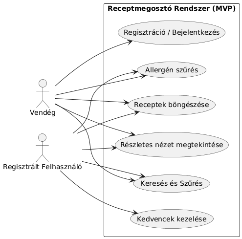
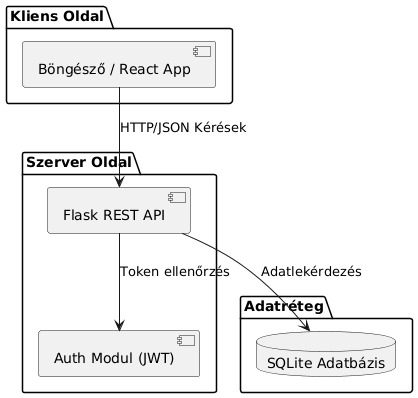
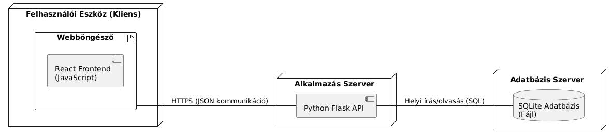
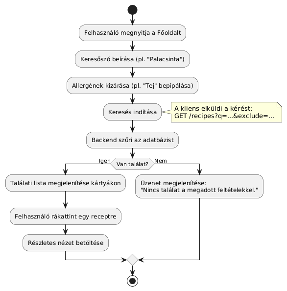

# Funkcionális specifikáció

**Projekt neve:** Receptmegosztó alkalmazás (RMA)
**Verzió:** 1.1 (MVP - Read-only/Favorites focus)
**Dátum:** 2025.12.12.
**Készítette:** Hallgatói projektcsapat (Flask + React + SQLite)

---

## 1. Bevezetés
Ez a dokumentum a Receptmegosztó alkalmazás aktuális állapotának részletes funkcionális működését írja le. A jelenlegi verzió egy MVP (Minimum Viable Product), amely a receptek böngészésére, keresésére, szűrésére és a **kedvencek kezelésére** fókuszál. A tartalomkezelés (recept feltöltés) és az értékelés a következő fejlesztési ciklusban valósul meg.

## 2. Rendszeráttekintés
A rendszer egy böngészőből elérhető webes alkalmazás. A felhasználók regisztráció után hozzáférhetnek a receptek részletes nézetéhez és elmenthetik azokat a kedvenceik közé. A vendégek is szabadon kereshetnek és szűrhetnek az adatbázisban lévő (előre feltöltött) receptek között.

### 2.1 MVP funkciók köre (Megvalósult)
A jelenlegi beadandó az alábbi funkciókat tartalmazza:
* **Autentikáció:** Felhasználói regisztráció és bejelentkezés (JWT alapú).
* **Böngészés:** Főoldal receptek listázásával.
* **Keresés és Szűrés:** Keresés kulcsszóra, kategóriára, valamint allergének kizárása (mentes szűrő).
* **Részletek:** Recept adatlap megjelenítése (kép, leírás, hozzávalók, lépések).
* **Interakció:** **Kedvencek kezelése** (hozzáadás/eltávolítás) bejelentkezett felhasználóknak.
* **Profil:** Alapszintű profiloldal a felhasználó adataival és a kedvencek listájával.

### 2.2 Nem része a jelenlegi MVP-nek (Átütemezve a következő verzióra)
Az alábbi funkciók fejlesztése technikai okokból a következő sprintre tolódott:
* Recept értékelése (Csillagozás): Jelenleg nem elérhető.
* Recept létrehozása/szerkesztése (UI): A felhasználók jelenleg nem tudnak új receptet feltölteni felületről.
* Admin felület: Nincs dedikált admin dashboard.
* Kommentelés.
* Bevásárlólista és Tápérték számítás.

## 3. Felhasználói felületek

### 3.1 Bejelentkezés / Regisztráció
* **Mezők:** E-mail cím, jelszó, név (regisztrációnál).
* **Műveletek:**
    * Bejelentkezés → Siker esetén JWT token fogadása és tárolása, átirányítás a főoldalra.
    * Regisztráció → Új fiók létrehozása, duplikáció ellenőrzése.

### 3.2 Főoldal (Receptlista)
A főoldal a központi navigációs pont.
* **Megjelenés:** Kártyás elrendezés (Grid).
* **Kártya tartalom:** Recept képe, címe, kategóriája.
* **Szűrési panel:**
    * Szöveges kereső: Cím és leírás keresése.
    * Kategória: Dropdown (pl. Levesek, Főételek).
    * Allergén kizárás: Checkbox lista.

### 3.3 Recept részletek (Details Page)
* **Tartalom:** Nagy felbontású kép, cím, rövid összefoglaló, hozzávalók listája, elkészítési lépések, allergének ikonjai.
* **Műveletek:**
    * **Kedvencek gomb (Szív ikon):** Bejelentkezett felhasználóknak elérhető. Kattintásra a recept bekerül a profilhoz tartozó listába, vagy kikerül onnan.

### 3.4 Profil oldal (My Profile)
* **Cél:** A bejelentkezett felhasználó adatainak megjelenítése.
* **Tartalom:**
    * Felhasználó neve és e-mail címe.
    * **Kedvenc receptek listája:** Itt jelennek meg a felhasználó által elmentett receptek.

## 4. Funkcionális folyamatok

### 4.1 Keresés és Allergén szűrés
A látogató beír egy kulcsszót és bejelöli pl. a „Glutén” és „Tej” opciókat a kizárásnál. A kliens csak azokat a recepteket jeleníti meg, amelyek nevében/leírásában szerepel a kulcsszó, ÉS az allergén listájukban nem szerepel a glutén vagy tej kódja.

### 4.2 Kedvencek kezelése
1.  A felhasználó bejelentkezik.
2.  Megnyit egy recept adatlapot vagy a kártyát nézi.
3.  A **Szív ikonra** kattint.
4.  A rendszer elmenti a kapcsolatot a felhasználó és a recept között (vagy törli, ha már létezett).
5.  Az ikon állapota (kitöltött/üres) frissül.

## 5. Adatmodell (Egyszerűsített)
* **User:** id, email, password_hash, created_at.
* **Recipe:** id, title, description, category, ingredients (JSON/Text), steps (JSON/Text), image_url.
* **Allergen:** id, name, code.
* **Favorite:** (kapcsolótábla) user_id, recipe_id, added_at.
* *(A Rating tábla kikerült az MVP modellből).*

## 9. Technikai architektúra és API

### 9.1 Backend API végpontok (Implementált)
* `POST /auth/register`: Regisztráció.
* `POST /auth/login`: Bejelentkezés (JWT).
* `GET /recipes`: Receptek listázása (szűrőkkel).
* `GET /recipes/<id>`: Egy recept részletei.
* `POST /recipes/<id>/favorite`: **Kedvencekhez adás / eltávolítás** (Auth header szükséges).
* `GET /allergens`: Allergén lista.

---

## 10. UML Ábrák
Az alábbi ábrák szemléltetik a rendszer felépítését és működését a fenti specifikáció alapján.

### 10.1 Használatieset-diagram (Use Case)
A diagram bemutatja a Vendég és a Regisztrált felhasználó lehetőségeit. Látható, hogy a "Kedvencek kezelése" csak a regisztrált felhasználó számára érhető el.

### 10.2 Osztálydiagram (Class Diagram)
Az adatbázis szerkezetét és az osztályok kapcsolatait mutatja. Kiemelendő a User és Recipe közötti több-a-többhöz kapcsolatot megvalósító Favorite osztály.

### 10.3 Szekvenciadiagram – Kedvencek kezelése
Ez az ábra részletezi a folyamatot, amikor a felhasználó a "Szív" ikonra kattint. Bemutatja a Frontend, a Backend (API) és az Adatbázis közötti kommunikációt, valamint a hitelesítés (Token) ellenőrzését.

### 10.4 Komponensdiagram
A rendszer fizikai és logikai komponenseinek felépítése: a React alapú kliens, a Flask API szerver és az adatbázis réteg kapcsolata.

### 10.5 Deployment diagram (Eszközök)
A telepítési környezet bemutatása: hogyan fut a kód a felhasználó eszközén (böngésző), az alkalmazásszerveren és az adatbázisszerveren.

### 10.6 Aktivitásdiagram – Keresés
A keresési és szűrési folyamat lépései, beleértve az allergének kizárását és a találatok (vagy hibaüzenet) megjelenítését.

